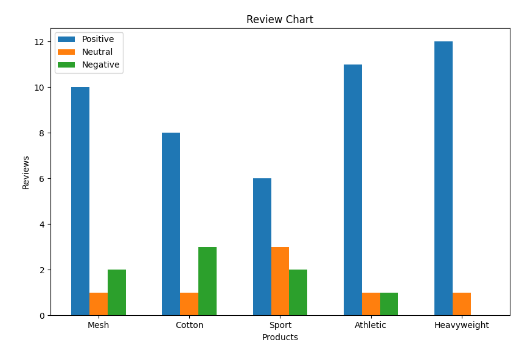

# Product Review
The following project was created using predominantly python, selenium, the phi3 language model, and matplotlib. The goal of the project, given a list of amazon listing urls, to respond with a graph displaying each product and their number of positive, neutral, and negative reviews. Installation and usage requires both the miniconda software and Phi-3 language model. All dependencies are listed in the requirements.yaml file. Setup is as followed:


### Installing Conda
  1. You can install the miniconda software using the installer links on the following page: https://docs.anaconda.com/miniconda/

### Installing language Model (Phi-3)
  1. Navigate to the Phi-3-mini-4k-instruct-q4.gguf page on the huggingface website. https://huggingface.co/microsoft/Phi-3-mini-4k-instruct-gguf/blob/main/Phi-3-mini-4k-instruct-q4.gguf
  2. Download the model. The download selection can be found near the center of the page.
  3. Move the model file to the file path of your choice. Save this path as it will be used later.

### Setting Up Environment
  1. Download or Copy the entire project on home computer. One way you can do this is by selecting the code button in top right of project and choosing the download zip file option.
  2. Unzip and move the folder to your preferred destination. 
  3. Navigate to file explorer and open the CS325PROJECT folder, then open the review folder using the code editor of your choice, or your terminal.
  6. Run the following command to create the conda environment, then open it: 
  ```powershell
  conda env create -f requirement.yaml
  conda activate review
  ```

### Utilization
  1. You must provide an input file with the amazon listing url seperated by line. Once the program is completed, a seperate window with a graph will be displayed on your screen.
  2. By using the the input_url.txt file already in the project, you can change or append urls in that text file then run the following code to execute the program. Make sure to write the name of each product after the -l. Example is as followed
  ```powershell
  python run.py input_url.txt -l Mesh Cotton Sport Athletic Heavyweight
  ```
  Example Output:

  
